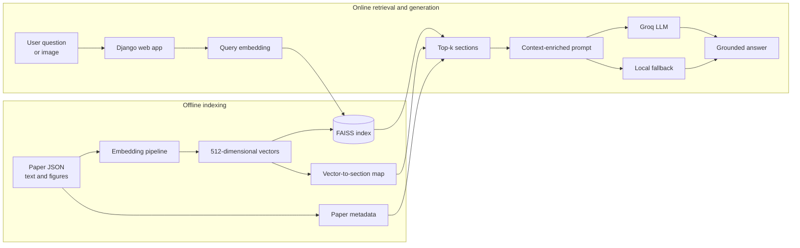

# Multimodal PDF RAG Pipeline

[](https://www.python.org/)
[](https://www.djangoproject.com/)
[](https://github.com/facebookresearch/faiss)
[](Dockerfile)

A retrieval-augmented generation system for exploring academic papers through
natural-language questions. The pipeline turns paper sections and figures into
512-dimensional vectors, retrieves relevant passages with FAISS, and gives the
retrieved context to a Groq-hosted language model through a Django web app.

The repository includes a prepared corpus of 30 papers, 287 indexed paper
sections, a browser interface, Docker packaging, and a Render deployment
blueprint. Querying remains usable without an LLM key through a deterministic
local fallback path.

## Architecture



## What the project demonstrates

- Multimodal vectorization of paper abstracts, sections, and images
- Shared 512-dimensional representation for text and image retrieval
- Exact nearest-neighbor search using a FAISS `IndexFlatL2` index
- Mapping from vector results back to paper IDs, section names, and source text
- Retrieval-augmented prompting through the Groq chat-completions API
- A Django interface supporting text questions and optional image uploads
- Automatic FAISS index reconstruction when the binary index is unavailable
- Docker and Render configuration for reproducible web deployment
- RocksDB-compatible metadata experiments through `rocksdict`

## How a query is processed

1. The browser submits the user's question to the embedding endpoint.
2. The app creates a 512-dimensional query vector.
3. FAISS returns the five nearest indexed paper sections by L2 distance.
4. The section map resolves each vector to its paper and section.
5. The original section text is loaded from the prepared paper corpus.
6. Retrieved context and the question are sent to the configured Groq model.
7. If Groq is not configured or temporarily unavailable, the app returns the
   most relevant retrieved context instead of failing the request.

## Embedding modes

The application supports two modes with different operational tradeoffs.

| Mode | Configuration | Behavior |
|---|---|---|
| Lightweight | Default | Produces deterministic 512-dimensional hash vectors without downloading a model. Suitable for deployment checks and low-resource demos. |
| CLIP | `USE_TRANSFORMERS_EMBEDDINGS=true` | Loads `openai/clip-vit-base-patch32` through Transformers for real text/image embeddings. Requires substantially more memory and downloads model weights on first use. |

The checked-in FAISS mapping contains precomputed vectors. Use the same
embedding strategy for corpus and query vectors when rebuilding the dataset;
mixing embedding spaces makes similarity scores meaningless.

## Technology stack

| Layer | Technology | Responsibility |
|---|---|---|
| Web application | Django, HTML, JavaScript | Query interface and JSON endpoints |
| Generation | Groq API | Context-aware answer generation |
| Embeddings | CLIP, Transformers, PyTorch | Text and image feature extraction |
| Vector search | FAISS | Nearest-neighbor section retrieval |
| Metadata prototype | `rocksdict` | RocksDB-compatible key-value storage |
| Serving | Gunicorn | Production WSGI process |
| Packaging | Docker | Reproducible runtime image |
| Hosting | Render | Infrastructure blueprint and auto-deploy configuration |

## Repository layout

```text
.
├── backend/
│   └── searchSimilarPaper.py       Standalone retrieval implementation
├── faiss_storage/
│   ├── embeddings_with_vectors.json Vector-to-section mapping
│   └── main.py                     FAISS index builder
├── json_vectorization/
│   ├── clip_vectorization.py       Text/image embedding functions
│   ├── main.py                     Corpus vectorization workflow
│   └── output_data.json            Prepared embeddings by paper and section
├── llm-integration/llmproject/
│   ├── llmapp/                     Django views, retrieval, template, and routes
│   └── llmproject/                 Django configuration
├── pdf_scraping/
│   └── combined_data.json          Prepared paper metadata and section text
├── rocks_storage/                  RocksDB-compatible storage prototype
├── tests/                          Component and UI validation scripts
├── Dockerfile                      Production container definition
├── render.yaml                     Render service blueprint
├── handler.py                      JSON-vectorization Lambda-style handler
├── main.py                         Repository-root FAISS index builder
└── requirements.txt                Runtime dependencies
```

## Quick start with Docker

Docker is the simplest path because it pins Python 3.10 and the required
native libraries.

```bash
git clone https://github.com/vmanam1/pdf-rag-pipeline.git
cd pdf-rag-pipeline
docker build -t pdf-rag-pipeline .
docker run --rm -p 8000:8000 \
  -e DJANGO_SECRET_KEY="replace-with-a-long-random-value" \
  -e DJANGO_DEBUG="false" \
  -e ALLOWED_HOSTS="localhost,127.0.0.1" \
  -e GROQ_API_KEY="your-groq-api-key" \
  pdf-rag-pipeline
```

Open <http://localhost:8000>.

`GROQ_API_KEY` is optional. Without it, retrieval still runs and the response
contains the most relevant source context rather than an LLM-generated answer.

## Local development

### Prerequisites

- Python 3.10
- A C/C++ compatible environment for any native wheels not available on the
  host platform
- Optional: a Groq API key
- Optional for CLIP mode: enough memory and network access to download model
  weights

### Installation

```bash
git clone https://github.com/vmanam1/pdf-rag-pipeline.git
cd pdf-rag-pipeline
python -m venv .venv
```

Activate the environment:

```bash
# macOS/Linux
source .venv/bin/activate

# Windows PowerShell
.venv\Scripts\Activate.ps1
```

Install dependencies and start Django:

```bash
python -m pip install --upgrade pip
python -m pip install -r requirements.txt
cd llm-integration/llmproject
python manage.py migrate
python manage.py runserver
```

The application will be available at <http://127.0.0.1:8000>.

## Configuration

| Variable | Required | Default | Purpose |
|---|---:|---|---|
| `DJANGO_SECRET_KEY` | Production | Development-only value | Django cryptographic signing key |
| `DJANGO_DEBUG` | No | `false` | Enables Django debug mode when set to `true` |
| `ALLOWED_HOSTS` | Production | `localhost,127.0.0.1,0.0.0.0` | Comma-separated accepted hostnames |
| `GROQ_API_KEY` | No | Empty | Enables LLM-generated answers |
| `GROQ_MODEL` | No | `llama-3.1-8b-instant` | Groq model used for generation |
| `USE_TRANSFORMERS_EMBEDDINGS` | No | `false` | Enables CLIP instead of lightweight vectors |

Do not place secrets in source files or commit a local `.env` file.

## Web endpoints

| Method | Endpoint | Purpose |
|---|---|---|
| `GET` | `/` | Render the query interface |
| `POST` | `/getEmbedding/` | Create a text or image query vector |
| `POST` | `/getSimilarContent/` | Retrieve the nearest paper sections |
| `POST` | `/getDataFromLLM/` | Generate an answer from query and context |
| `POST` | `/uploadFile/` | Store an image for multimodal embedding |

Example text-embedding request:

```bash
curl -X POST http://127.0.0.1:8000/getEmbedding/ \
  -H "Content-Type: application/json" \
  -d '{"type":"text","text":"How is deduplication used in cloud storage?"}'
```

## Rebuild the vector index

The prepared embeddings and vector map are committed for demonstration. To
recreate the FAISS binary index from `json_vectorization/output_data.json`:

```bash
python main.py
```

This writes:

- `faiss_storage/faiss_index.idx`
- `faiss_storage/embeddings_with_vectors.json`

The Django retrieval module also reconstructs `faiss_index.idx` automatically
from the vector mapping when the binary file is absent.

To vectorize another prepared corpus JSON file:

```bash
python -m json_vectorization.main input.json output_embeddings.json
```

Expected paper records may contain `abstract`, `sections`, and `images` fields.
Remote images are downloaded temporarily, embedded, and then removed.

## Component validation

The repository contains standalone validation scripts for the storage and
indexing components:

```bash
python tests/test_faiss.py
python tests/test_rocksdb.py
```

`tests/testing_UI_and_Vectorization.py` is an optional manual integration test.
It requires Selenium, Chrome/ChromeDriver, a running Django server, and CLIP
model access; these tools are intentionally not part of the minimal runtime
requirements.

## Deploy on Render

The included `render.yaml` defines a Docker web service with `/` as its health
check path.

1. Create a new Render Blueprint from this repository.
2. Configure `DJANGO_SECRET_KEY` and the public Render hostname in
   `ALLOWED_HOSTS`.
3. Add `GROQ_API_KEY` to enable generated answers.
4. Optionally set `GROQ_MODEL` or `USE_TRANSFORMERS_EMBEDDINGS`.
5. Deploy. Gunicorn listens on port `8000` inside the container.

CLIP mode can exceed the memory available on small hosting plans. The default
lightweight mode exists so the web workflow can run in constrained containers.

## Current scope and tradeoffs

- FAISS uses exact L2 search, which is simple and accurate for this small
  corpus but does not provide approximate-search scaling for millions of
  vectors.
- The prepared demonstration corpus contains 30 papers and 287 indexed
  sections; this repository does not currently automate PDF extraction.
- RocksDB-compatible storage is a separate prototype and is not on the Django
  request path.
- Uploaded files and generated indexes use local container storage. Production
  deployments should use durable object storage and lifecycle policies.
- The lightweight embedding fallback is deterministic but not semantic. Use
  CLIP or another production embedding model for meaningful retrieval over a
  rebuilt corpus.
- Public deployment should add rate limiting, upload validation, CSRF-aware API
  design, structured logging, and automated tests before handling untrusted
  traffic.

## Future improvements

- Extract text, tables, and figures directly from uploaded PDFs
- Add chunking with overlap and source-page citations
- Replace local artifacts with object storage and a managed vector database
- Add reranking and retrieval-quality evaluation datasets
- Stream generated responses in the browser
- Introduce background indexing jobs and corpus versioning
- Add CI for unit, retrieval, security, and container smoke tests
